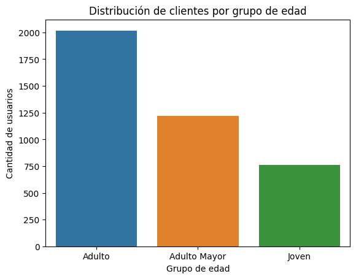
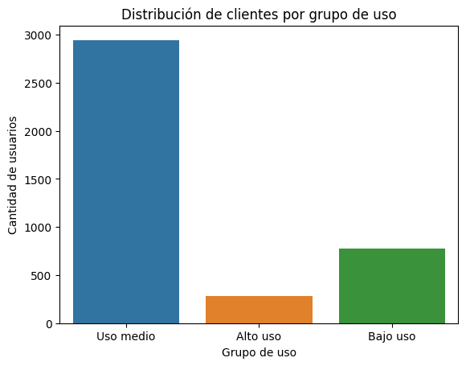

# Análisis de clientes de ConnectaTel

## Objetivo del proyecto

Analizar el comportamiento de los clientes de ConnectaTel mediante técnicas de análisis exploratorio de datos (EDA), limpieza de datos, segmentación y visualización, con el fin de identificar patrones de uso y generar recomendaciones comerciales basadas en datos.

---

## Datasets utilizados

- **plans.csv** → Información de los planes actuales: precio, minutos, GB y costos extra.
- **users.csv** → Información demográfica y de registro de los usuarios.
- **usage.csv** → Información histórica de llamadas y mensajes durante 2024.

---

## Preparación y calidad de los datos

Durante la preparación de los datos se identificaron valores faltantes, inválidos y fechas fuera de rango.

Entre los principales hallazgos de calidad se encontraron:

- **96 registros (2,4%)** con valores inválidos en `city`.
- Valores de edad inválidos que fueron tratados como datos faltantes e imputados utilizando la mediana.
- **40 registros** con fechas de registro fuera del rango esperado.
- **50 registros** con valores inválidos o faltantes en `usage.date`.
- Se analizaron los valores nulos en `duration` y `length`, determinando que algunos correspondían al tipo de registro (llamada o mensaje) y no necesariamente a errores de captura.

Estas decisiones permitieron conservar información relevante y preparar una base más consistente para el análisis.

---

## Etapas del análisis

1. Carga y exploración de datos.
2. Limpieza y preparación de datos.
3. Análisis exploratorio de datos (EDA).
4. Detección y análisis de outliers.
5. Segmentación de clientes por edad y nivel de uso.
6. Interpretación de resultados y generación de recomendaciones de negocio.

---

## Herramientas utilizadas

- Python
- Pandas
- NumPy
- Matplotlib
- Seaborn
- Jupyter Notebook

---

## Hallazgos principales

- Aproximadamente **2.950 usuarios (74%)** pertenecen al segmento de **Uso medio**, convirtiéndolo en el grupo dominante de la base de clientes.
- Cerca de **780 usuarios (19%)** presentan **Bajo uso**, un segmento con oportunidades de activación y mayor interacción.
- Aproximadamente **280 usuarios (7%)** corresponden a **Alto uso**. Aunque representan el grupo más pequeño, pueden constituir clientes de alto valor y oportunidades para planes especializados o upgrades.
- La base de clientes está concentrada principalmente en **adultos**, mientras que los usuarios jóvenes tienen menor representación, lo que sugiere una oportunidad de crecimiento en este segmento.

---

## Visualizaciones principales

### Distribución de clientes por grupo de edad

La segmentación muestra una mayor concentración de clientes adultos, seguida por adultos mayores, mientras que los usuarios jóvenes representan el grupo de menor tamaño.

### Distribución de clientes por nivel de uso

La mayoría de los clientes presenta un nivel de uso medio. Los segmentos de bajo y alto uso representan grupos más pequeños con necesidades y oportunidades comerciales diferentes.

---

## Recomendaciones de negocio

- **Optimizar la propuesta para usuarios de Uso medio**, ya que representan aproximadamente el 74% de la base y constituyen el principal segmento de clientes.
- Desarrollar **campañas de activación para usuarios de Bajo uso**, buscando aumentar su interacción y reducir posibles riesgos de abandono.
- Diseñar beneficios, planes especializados o posibilidades de **upgrade para usuarios de Alto uso**, aprovechando su mayor intensidad de consumo.
- Explorar estrategias comerciales orientadas a **usuarios jóvenes**, actualmente menos representados en la base de clientes.

---

## Cómo ejecutar el proyecto

1. Descargar el notebook `.ipynb`.
2. Abrirlo en **Jupyter Notebook** o **Google Colab**.
3. Ejecutar las celdas en orden.
4. Revisar el análisis, las visualizaciones y las conclusiones.

---

## Autor

**Víctor Martínez Márquez**

Data Analyst | SQL, Python & Power BI  
Análisis de datos con enfoque en ingeniería, operaciones y negocio

**LinkedIn:** www.linkedin.com/in/victormartinezm31
